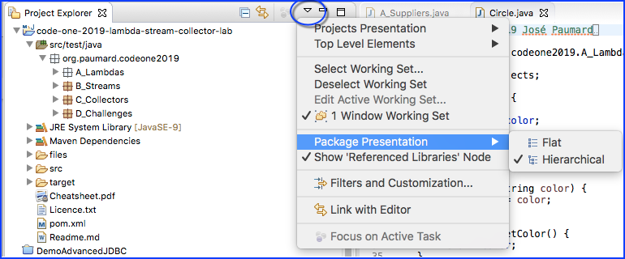

### Oracle Code One 2019  Lambda Stream Collector Lab

You are are currently on the master branch on this repository. This repository contains branches for each version of Java from 8 to 12, and for two IDEs: Eclipse and IntelliJ. 

#### Choosing the right branch and downloading the lab 

0. The first thing you need to do is to choose the right branch that corresponds to your Java installation and your IDE. For that, you need to click on the `Branch` button on the GitHub interface. 

    

1. And then choose the branch you need from the drop down list. On this example we are choosing Java 9 and Eclipse. 

    

2. From here, you should check the `Branch` button and make sure that you have selected the right one. 

    

3. All you need to do now is download a ZIP file for that branch, by clicking the `Clone or download` green button that will contain the right version of the lab for you.

    


#### Importing the lab in Eclipse

0. Unzip the ZIP file for the project. 

1. Open Eclipse. Select `Preferences | Java | Editor | Folding`. 
   
      Ensure that the `Comments` checkbox is ticked. This ensures that the hints we put with the exercises will be closed by default when you open an exercise file.
       
      Ensure that the Project Explorer or Package Explorer view property `Package Presentation` is set to `Hierarchical`, as shown below:
       
      
      
2. Select `File | Import... | Maven | Existing Maven Projects`, click
      `Next`, select the directory where you unzipped the lab and click `Finish`.

3. Make sure Eclipse selected the right version of the JDK for your lab to work properly. 

#### Importing the lab in IntelliJ

0. Unzip the ZIP file for the project. 

1. Open IntelliJ. Select `File | New | Project from existing sources...`, select the directory where you unzipped the lab and click `Ok`.

3. IntelliJ will then take you through the Maven import process until the project is correctly configured.  

4. Make sure IntelliJ selected the right version of the JDK for your lab to work properly. 

#### Some more instructions

The lab is almost the same on all the branches. Several questions have been removed from the Java 8 branch, since they rely on API added in Java 9 or later.  

You should check the PDF file called `Cheatsheet.pdf` for the useful information it contains about the patterns, classes and methods you are going to need in this lab. Ultimately, you should check the Javadoc.  

You will find the following content in the `test/java` folder:

1. A `A_Lambdas` package
2. A `B_Collections` package
3. A `C_Maps` package
4. A `D_Streams` package
5. A `E_Collectors` package
6. A `F_Challenges` package

Maven declares two dependencies: JUnit and AssertJ. Just make sure that your configuration allows for the downloading of them. 

Each package is then divided into subpackages and classes so that you can easily find your way in the lab. The difficulty is increasing from beginner level to challenge level in each package. If the first questions are too easy for you, just jump to the end and to try the challenges!

The solutions of the exercises are provided in the `src/solutions/java` folder. You can run them by declaring this folder as a source folder in your IDE.  

Each package contains JUnit test classes that you need to modify so that the tests pass.  

For instance, here is the first method of the first test class `A_Suppliers`: 

```Java
    @Test
    @Ignore
    public void a_supplier01() {
        Supplier<StringBuilder> sup = null; // TODO
        assertThat(sup.get().toString()).isEqualTo("abc");
    }
```

The first thing you need to do to run the test is to remove the `@Ignore` annotation so that the test will be run. If you run it as it is, it will be red.

Then you need to modify the line where the `// TODO` mark is found so that the test becomes green. In this very simple case, you can write the following: 

```Java
    @Test
    public void a_supplier01() {
        Supplier<StringBuilder> sup = () -> new StringBuilder("abc");
        assertThat(sup.get().toString()).isEqualTo("abc");
    }
```

If you run this test it should be green, so you can move to the next one. 

Depending on the branch you are looking at, there are up to 126 exercises in the lab, enough to keep you busy for several hours. Good luck!