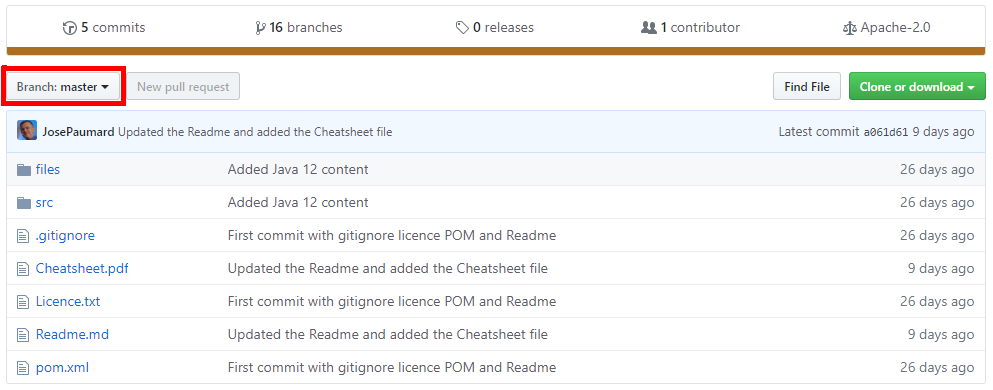
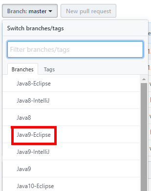
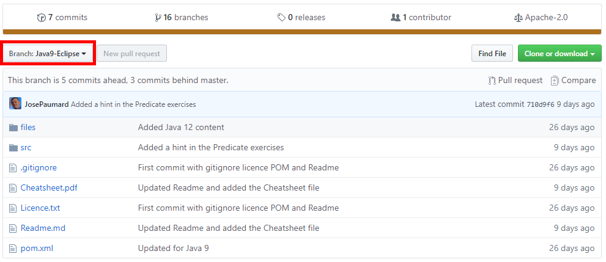
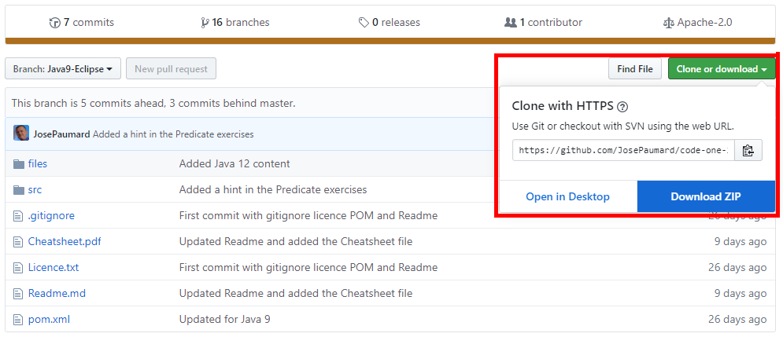

### Oracle Code One 2019  Lambda Stream Collector Lab

#### Introduction

Welcome to the Lambda/Streams Programming Laboratory! The goal of this lab is for you to learn about the lambda expressions, default methods, and APIs (particularly the Streams library) introduced in Java 8.

You are are currently on the ***Java10-IntelliJ*** branch on this repository. This repository contains branches for each version of Java from 8 to 12, and for two IDEs: Eclipse and IntelliJ. 

#### Choosing the right branch and downloading the lab 

0. The first thing you need to do is to choose the right branch that corresponds to your Java installation and your IDE. For that, you need to click on the `Branch` button on the GitHub interface. 

    

1. And then choose the branch you need from the drop down list. On this example we are choosing Java 9 and Eclipse. 

    

2. From here, you should check the `Branch` button and make sure that you have selected the right one. 

    

3. All you need to do now is download a ZIP file for that branch, by clicking the `Clone or download` green button that will contain the right version of the lab for you.

    


#### Importing the lab in IntelliJ

0. Unzip the ZIP file for the project. 

1. Open IntelliJ. Select `File | Settings...` and look for the `Custom folding regions` property. Ensure it is ticked. This ensures that the hints we put with the exercises 	will be closed by default when you open an exercise file.

2. Select `File | New | Project from existing sources...`, select the directory where you unzipped the lab and click `Ok`.

3. IntelliJ will then take you through the Maven import process until the project is correctly configured.  

4. Make sure IntelliJ selected the right version of the JDK for your lab to work properly. 

5. Maven declares two dependencies: JUnit and AssertJ. Just make sure that your configuration allows for the downloading of them. 


#### Some more instructions

The lab is almost the same on all the branches. Several questions have been removed from the Java 8 branch, since they rely on API added in Java 9 or later.

At the top of each exercise is a comment that describes the goal of the exercise. Within the test method, there is a `// TODO` comment that marks the location where you need fill in some implementation code. There may be some setup code above the `// TODO` comment, and there will be some assertion-checking code below. You shouldn't have to modify any of the setup code at the top of the test method or the assertions at the bottom of the test method.

For instance, here is the first method of the first test class `A_Suppliers`: 

```Java
    @Test
    @Ignore
    public void a_supplier01() {
        Supplier<StringBuilder> sup = null; // TODO
        assertThat(sup.get().toString()).isEqualTo("abc");
    }
```

The first thing you need to do to run the test is to remove the `@Ignore` annotation so that the test will be run. If you run it as it is, it will be red.

Then you need to modify the line where the `// TODO` mark is found so that the test becomes green. In this very simple case, you can write the following: 

```Java
    @Test
    public void a_supplier01() {
        Supplier<StringBuilder> sup = () -> new StringBuilder("abc");
        assertThat(sup.get().toString()).isEqualTo("abc");
    }
```

If you run this test it should be green, so you can move to the next one. 

There is sometimes a hint or two after a test method. If you're having trouble with an exercise, look for hints. The hint text is inside a editor fold that is closed by default, so click on the plus-sign in the left margin to read it.


You should check the PDF file called `Cheatsheet.pdf` for the useful information it contains about the patterns, classes and methods you are going to need in this lab. Ultimately, you should check the Javadoc.  

You will find the following content in the `test/java` folder:

1. A `A_Lambdas` package
2. A `B_Collections` package
3. A `C_Maps` package
4. A `D_Streams` package
5. A `E_Collectors` package
6. A `F_Challenges` package

Each package is then divided into subpackages and classes so that you can easily find your way in the lab. The difficulty is increasing from beginner level to challenge level in each package. If the first questions are too easy for you, just jump to the end and to try the challenges!

The intent of the exercises is to solve them using the Java 8 lambda expressions feature, the Java 8 default methods feature, the Java 8 Streams API, and other APIs added in Java 8. Of course, it is possible to use conventional Java code, such as for-loops, but all of the exercises are amenable to being solved using new features in just a handful of lines. Most exercises will take less than half a dozen lines. Some of the more difficult exercises may take up to eight lines, depending upon how aggressive you are about breaking lines. None of the exercises involve writing large amounts of code. Most of the streams-based exercises involve writing a single stream pipeline.

Several of the exercises read data from a text file. The field named "reader" is a `BufferedReader` which will be opened for you on the text file. In any exercise that refers to reading from the text file, you can simply use the "reader" variable without worry about opening or closing it. This is set up by JUnit using the `@Before` and `@After` methods at the bottom of the file. The text files you need are provided with the project.

If you're really stuck, the solutions to the exercises are in the folder `src/solutions/java`. You can run them by declaring this folder as a source folder in your IDE.

There is one solutions file corresponding to each exercise file. Many exercises can be solved in several different ways. In some cases, the solutions file will have several alternatives. Even if you've solved an exercise, it can be useful to look at the solutions to compare your solutions with those of the lab authors.

There are to 127 exercises in the lab, enough to keep you busy for several hours. Good luck!